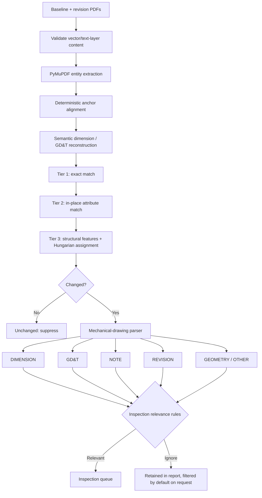

# PDF Differences Objects

Desktop revision review for native CAD-exported PDFs. The application compares
the PDF's exact vector paths and positioned text spans, aligns the two drawing
revisions, matches entities in deterministic tiers, and flags changes that may
matter to mechanical inspection.

It deliberately has:

- no image or pixel comparison;
- no OCR or Tesseract fallback;
- no PyTorch or learned model;
- no SciPy runtime dependency;
- no web server or browser frontend.

The desktop interface is built with PyQt6. PyMuPDF rasterizes pages only after
analysis, solely to provide the human-facing preview; preview pixels never enter
the comparison pipeline.

## Pipeline



The matching order borrows the *concept* of CADMorph's tiered cascade: resolve
cheap, certain correspondences first and reserve global assignment for ambiguous
entities. Tier 3 uses only deterministic geometry, text, style, spatial-context,
and distance features. It does not use CADMorph code, weights, or PyTorch.

After alignment and before matching, the comparison pipeline reconstructs
high-confidence mechanical callouts from raw PDF fragments. This is deliberately
conservative: dimension grammar, stacked-tolerance structure, or GD&T frame
topology and containment must prove that fragments belong together. Proximity
can nominate candidates, but it never approves a group by itself. If any member
changes, the dimension or GD&T frame produces one table row and its entire union
box blinks in the viewer. Repeated callouts use unambiguous leader/feature
attachment points during matching; materially tied candidates remain separate
additions/removals instead of becoming a potentially false modification.
Standalone tolerance signs emitted by CAD exporters are paired with their
numeric spans only when baseline, direction, reading order, and ambiguity checks
agree. GD&T cells can also be rebuilt from connected horizontal and vertical
line segments when one exporter drawing record contains several disconnected
objects; unrelated residual geometry remains available to normal matching.

## Install and run

Python 3.11 or newer is required.

```powershell
git clone https://github.com/jxfuller1/PDF-differences-objects.git
cd PDF-differences-objects
py -3.11 -m venv .venv
.\.venv\Scripts\Activate.ps1
python -m pip install -e .
pdf-differences
```

On macOS/Linux, activate with `source .venv/bin/activate` and run the same
installation and launch commands.

In the app:

1. Select or drop the baseline and revised PDFs.
2. Choose **Compare PDFs**.
3. Review the aligned revisions in one overlay. The slider endpoints show each
   PDF in its original colors; between them, old content is red and new content
   is blue. Use **Old**, **Differences**, and **New** to jump to key positions.
4. Use the **Additions**, **Removals**, **Regions**, and **Blink** checkboxes to
   control the overlays. Selecting a table row zooms and centers its region;
   clicking a region selects and reveals its corresponding table row.
5. Filter by change type, parser category, free text, or inspection relevance.
   Type and category use Excel-style checkbox menus with **Select All** and
   **Unselect All** actions. The table and visible change regions always use
   the same active filters.
6. Export structured JSON, CSV, or an annotated copy of the revised PDF.

## Viewer appearance and blink settings

Edit `src/pdf_differences/ui/viewer_settings.py` to change the old/new page
tints, addition/removal/other region colors, blink duration and curve, border
and fill opacity, border width, or selected-region emphasis. Region colors are
separate from page tint colors, so either can be adjusted independently.

The sample pair in `samples/mechanical_pair` is completely vector-native:

```powershell
pdf-differences-cli samples/mechanical_pair/baseline.pdf `
  samples/mechanical_pair/revision.pdf `
  --json result.json --csv result.csv --annotated marked.pdf
```

Regenerate it with `python tools/generate_sample.py`.

## Matching tiers

1. **Exact** — identical content/style signature at the registered position.
   These entities are unchanged and leave the pipeline immediately.
2. **Attribute** — same entity kind in the same local slot, scored from text,
   shape, style, bounding-box overlap, and size. This captures dimension-value,
   note, style, and local geometry edits.
3. **Structural** — remaining nearby candidates are scored from handcrafted
   shape/text/context features, then assigned one-to-one with deterministic
   minimum-cost assignment. Small components use a NumPy-backed Hungarian
   solver; unusually large components use bounded-memory Python min-cost flow.
   A spatial hash enforces the search-radius gate that prevents distant
   lookalikes from becoming false moves.

Alignment uses unique unchanged text and geometry signatures to estimate a
translation/rotation/uniform-scale transform. Comparisons are declined when a
populated page has enough anchors but no reliable transform, instead of emitting
a misleading whole-sheet change. When fewer than two anchors are available, the
viewer safely overlays the page frames without applying an unverified translation.
The same page-frame fallback applies when a proposed transform would move the
top-left page origin beyond the configured sanity limit. The default is 15% of
either normalized page dimension and can be changed with
`ComparisonSettings.alignment_max_origin_shift` in `config.py`.

## Mechanical parser and relevance

Every reported change carries:

- change type: `added`, `removed`, `moved`, or `modified`;
- category: `DIMENSION`, `GD&T`, `NOTE`, `REVISION`, `GEOMETRY`, or `OTHER`;
- a boolean inspection-relevance decision;
- a plain-language reason for that decision;
- match tier and deterministic similarity score when applicable;
- before/after text and entity IDs for traceability.

Reconstructed callouts also preserve their internal member IDs and attachment
points so downstream comparison and exports can explain how a composite was
built. Unsupported or ambiguous layouts are left as raw entities and continue
through the pipeline unchanged.

The reconstruction thresholds live with the other analysis settings in
`src/pdf_differences/config.py`. The `callout_*gap*` and `callout_*tolerance*`
values control normalized candidate limits, while the attachment and ambiguity
settings control how conservatively repeated callouts may pair. They should be
calibrated against labeled project drawings before being loosened.
`callout_segment_connect_tolerance` is deliberately much tighter than frame
containment and should only absorb PDF coordinate noise. The frame height,
cell-width, total-width, and cell-count limits bound topology reconstruction.

Dimensions, GD&T, and changed geometry are relevant by default. Notes require a
configured inspection keyword. Plain revision letters, dates, and approval
metadata are retained but ignored by the inspection filter unless their text
describes a technical inspection impact. See
[docs/relevance-rules.md](docs/relevance-rules.md) for the rules and caveats.

## Tests and quality checks

```powershell
python -m pip install -e ".[dev]"
pytest
ruff check src tests tools benchmarks
ruff format --check src tests tools benchmarks
```

The test suite covers raster rejection, extraction determinism, similarity
alignment, all three matching tiers, moved-versus-added/removed behavior,
mechanical categories, inspection relevance, multi-page additions, exports,
semantic dimension/GD&T reconstruction, repeated-callout ambiguity, whole-box
viewer behavior, and end-to-end vector drawing pairs.

### SciPy reference benchmark

The former SciPy primitives remain available outside the application as an
optional benchmark oracle. This compares native and SciPy matching time, entity
pairing, unmatched entities, and the final detected-change records. Extraction
and alignment run once outside the timer, so the reported time isolates matching.

```powershell
python -m pip install -e ".[dev,benchmark]"
python -m benchmarks.compare_scipy --repeat 7
python -m benchmarks.compare_scipy --repeat 7 `
  --pair drawing old.pdf new.pdf `
  --pair second-drawing older.pdf newer.pdf
```

The command exits unsuccessfully if either matching or detected-change output
differs. See [benchmarks/README.md](benchmarks/README.md) for the JSON mode and
interpretation guidance.

## Scope and limitations

- Pages are paired by index; page reordering is not inferred.
- Text-only pages are accepted, but the report explicitly states that geometry
  was unavailable. Raster-only pages are rejected. Pages dominated by embedded
  imagery are also rejected when their visible vector/text layer is sparse or
  spatially tiny; the coverage and content thresholds are configurable in
  `ComparisonSettings`. By default, imagery covering at least 85% of a page
  requires more than five visible entities and more than 2% structured coverage.
- Entity granularity still depends partly on how the originating CAD software
  grouped paths in its PDF display list. Disconnected straight-line batches are
  split locally for GD&T topology, but ambiguous or curved batches are preserved.
- Fully transparent and all-white drawing paths are treated as non-visible CAD
  export masks, so they do not create false added-geometry rows.
- Custom symbol fonts may expose replacement/private-use characters. Known GD&T
  words and common Unicode symbols are supported, but a human should review any
  unclassified text.
- Inspection relevance is a transparent rules engine, not a release decision.
  Validate and tune it against representative drawings before production use.
- Current thresholds are exercised by synthetic tests; project-specific
  calibration against labeled revision pairs is strongly recommended.

## Provenance and license

This repository is based on
[CaD-Track](https://github.com/joedanields/CaD-Track) and retains its Apache-2.0
license and attribution. It is a substantially modified derivative: the
FastAPI/browser, image-input, raster tracing, OCR, and Tesseract paths were
removed; the alignment, matching, parser, reporting, tests, packaging, and PyQt6
desktop interface were replaced or added.

[CADMorph](https://github.com/Mirdula18/CADMorph) informed the high-level tiered
matching design. CADMorph had no declared license when reviewed, so this project
does not copy its source or include its models. Details are recorded in `NOTICE`.

Licensed under the Apache License, Version 2.0. See [LICENSE](LICENSE).
