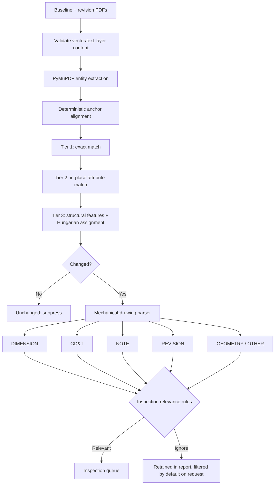

# PDF Differences Objects

Desktop revision review for native CAD-exported PDFs. The application compares
the PDF's exact vector paths and positioned text spans, aligns the two drawing
revisions, matches entities in deterministic tiers, and flags changes that may
matter to mechanical inspection.

It deliberately has:

- no image or pixel comparison;
- no OCR or Tesseract fallback;
- no PyTorch or learned model;
- no web server or browser frontend.

The desktop interface is built with PyQt6. PyMuPDF rasterizes pages only after
analysis, solely to provide the human-facing preview; preview pixels never enter
the comparison pipeline.

## Pipeline



The matching order borrows the *concept* of CADMorph's tiered cascade: resolve
cheap, certain correspondences first and reserve global assignment for ambiguous
entities. Tier 3 uses only deterministic geometry, text, style, spatial-context,
and distance features. It does not use CADMorph code, weights, or PyTorch.

## Install and run

Python 3.11 or newer is required.

```powershell
git clone https://github.com/jxfuller1/PDF-differences-objects.git
cd PDF-differences-objects
py -3.11 -m venv .venv
.\.venv\Scripts\Activate.ps1
python -m pip install -e .
pdf-differences
```

On macOS/Linux, activate with `source .venv/bin/activate` and run the same
installation and launch commands.

In the app:

1. Select or drop the baseline and revised PDFs.
2. Choose **Compare PDFs**.
3. Review the aligned revisions in one overlay. The slider endpoints show each
   PDF in its original colors; between them, old content is red and new content
   is blue. Use **Old**, **Differences**, and **New** to jump to key positions.
4. Use the **Additions**, **Removals**, **Regions**, and **Blink** checkboxes to
   control the overlays. Selecting a table row zooms and centers its region;
   clicking a region selects and reveals its corresponding table row.
5. Filter by change type, parser category, free text, or inspection relevance.
6. Export structured JSON, CSV, or an annotated copy of the revised PDF.

The sample pair in `samples/mechanical_pair` is completely vector-native:

```powershell
pdf-differences-cli samples/mechanical_pair/baseline.pdf `
  samples/mechanical_pair/revision.pdf `
  --json result.json --csv result.csv --annotated marked.pdf
```

Regenerate it with `python tools/generate_sample.py`.

## Matching tiers

1. **Exact** — identical content/style signature at the registered position.
   These entities are unchanged and leave the pipeline immediately.
2. **Attribute** — same entity kind in the same local slot, scored from text,
   shape, style, bounding-box overlap, and size. This captures dimension-value,
   note, style, and local geometry edits.
3. **Structural** — remaining nearby candidates are scored from handcrafted
   shape/text/context features, then assigned one-to-one with a global minimum-
   cost bipartite solver (dense Hungarian for small groups, sparse for large
   groups). A search-radius gate prevents distant lookalikes from becoming false
   moves.

Alignment uses unique unchanged text and geometry signatures to estimate a
translation/rotation/uniform-scale transform. Comparisons are declined when a
populated page has enough anchors but no reliable transform, instead of emitting
a misleading whole-sheet change.

## Mechanical parser and relevance

Every reported change carries:

- change type: `added`, `removed`, `moved`, or `modified`;
- category: `DIMENSION`, `GD&T`, `NOTE`, `REVISION`, `GEOMETRY`, or `OTHER`;
- a boolean inspection-relevance decision;
- a plain-language reason for that decision;
- match tier and deterministic similarity score when applicable;
- before/after text and entity IDs for traceability.

Dimensions, GD&T, and changed geometry are relevant by default. Notes require a
configured inspection keyword. Plain revision letters, dates, and approval
metadata are retained but ignored by the inspection filter unless their text
describes a technical inspection impact. See
[docs/relevance-rules.md](docs/relevance-rules.md) for the rules and caveats.

## Tests and quality checks

```powershell
python -m pip install -e ".[dev]"
pytest
ruff check src tests tools
ruff format --check src tests tools
```

The test suite covers raster rejection, extraction determinism, similarity
alignment, all three matching tiers, moved-versus-added/removed behavior,
mechanical categories, inspection relevance, multi-page additions, exports, and
an end-to-end vector drawing pair.

## Scope and limitations

- Pages are paired by index; page reordering is not inferred.
- Text-only pages are accepted, but the report explicitly states that geometry
  was unavailable. Raster-only pages are rejected.
- Entity granularity depends on how the originating CAD software grouped paths
  in its PDF display list.
- Fully transparent and all-white drawing paths are treated as non-visible CAD
  export masks, so they do not create false added-geometry rows.
- Custom symbol fonts may expose replacement/private-use characters. Known GD&T
  words and common Unicode symbols are supported, but a human should review any
  unclassified text.
- Inspection relevance is a transparent rules engine, not a release decision.
  Validate and tune it against representative drawings before production use.
- Current thresholds are exercised by synthetic tests; project-specific
  calibration against labeled revision pairs is strongly recommended.

## Provenance and license

This repository is based on
[CaD-Track](https://github.com/joedanields/CaD-Track) and retains its Apache-2.0
license and attribution. It is a substantially modified derivative: the
FastAPI/browser, image-input, raster tracing, OCR, and Tesseract paths were
removed; the alignment, matching, parser, reporting, tests, packaging, and PyQt6
desktop interface were replaced or added.

[CADMorph](https://github.com/Mirdula18/CADMorph) informed the high-level tiered
matching design. CADMorph had no declared license when reviewed, so this project
does not copy its source or include its models. Details are recorded in `NOTICE`.

Licensed under the Apache License, Version 2.0. See [LICENSE](LICENSE).
